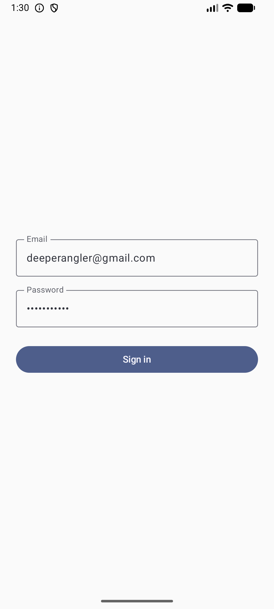
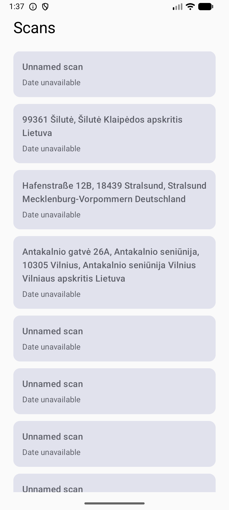
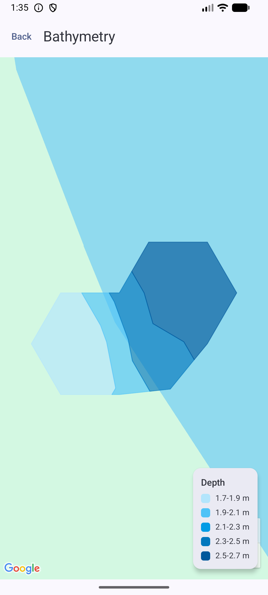

# DeeperTask

DeeperTask is a native Android application created for the Deeper Android programming assignment.
It authenticates against the provided staging service, displays the user's sonar scan sessions, and
renders a selected scan as coloured bathymetry polygons on Google Maps.

The application supports Android 8.0 (API 26) and newer.

## Features

- Native email and password login against the Deeper staging API.
- Scan-session list with names and available creation dates.
- Google Maps bathymetry view backed by GeoJSON polygon data.
- Depth-band colours and an on-map legend.
- Room-backed scan metadata and bathymetry cache.
- Loading, empty, validation, authentication, connectivity, service, data, and storage states.

## Screenshots

| Login | Scans | Bathymetry |
| --- | --- | --- |
|  |  |  |

## Requirements

- Android Studio with Android SDK 37 installed.
- Internet access for Gradle dependency and pinned daemon-JVM provisioning.
- A Google Maps Platform API key with **Maps SDK for Android** enabled.
- An Android device or emulator running API 26 or newer.

The Gradle wrapper is included. The project pins its Gradle daemon to JDK 25 through
`gradle/gradle-daemon-jvm.properties`; Gradle can provision that runtime automatically.

## Setup

1. Clone the repository and enter it:

   ```shell
   git clone https://github.com/AlgrdFit/Deeper-Task.git
   cd Deeper-Task
   ```

2. Create `local.properties` in the repository root. Android Studio normally writes `sdk.dir`
   automatically. Add the Maps key locally:

   ```properties
   sdk.dir=/absolute/path/to/Android/sdk
   MAPS_API_KEY=your_restricted_android_maps_key
   ```

   On Windows, Android Studio may write an escaped path such as
   `sdk.dir=C\:\\Users\\name\\AppData\\Local\\Android\\Sdk`.

3. Restrict the Maps key in Google Cloud Console to Android applications using package name
   `com.deeper.deepertask` and the SHA-1 certificate fingerprint of the signing key. For the local
   debug build, obtain that fingerprint with:

   ```shell
   ./gradlew signingReport
   ```

   `local.defaults.properties` contains only a placeholder so a clean checkout can compile. A real
   key is required for Google Maps tiles to render. `local.properties` is ignored by Git.

4. Open the project in Android Studio, allow Gradle sync to finish, select the `app` configuration,
   and run it on an API-26+ device.

The Deeper staging base URL is part of the networking module and is not a secret. The evaluator's
demo login values from the assignment are intentionally prefilled on the login screen; replace them
before using the project outside this review context.

## Build and verify

macOS/Linux:

```shell
./gradlew lint test :app:assembleDebug
```

Windows:

```powershell
.\gradlew.bat lint test :app:assembleDebug
```

The evaluation APK is generated at:

```text
app/build/outputs/apk/debug/app-debug.apk
```

Install it with the Android SDK's `adb`:

```shell
adb install -r app/build/outputs/apk/debug/app-debug.apk
```

The packaged evaluation build is also attached to the
[v1.0.0 GitHub Release](https://github.com/AlgrdFit/Deeper-Task/releases/tag/v1.0.0).

## Architecture

The project uses modular Clean Architecture. Feature implementation modules own their presentation,
domain, and data details, while contracts needed outside a feature live in small `api` modules.
Dependencies point toward contracts and domain logic; feature implementation modules never depend on
another feature's implementation.

| Module | Responsibility |
| --- | --- |
| `:app` | Application composition, the Navigation 3 back stack, and feature entry aggregation. |
| `:core:navigation` | Framework-neutral shared navigation contracts. |
| `:core:network` | Retrofit, OkHttp, Gson, timeouts, and shared network error mapping. |
| `:core:database` | Room database, scan metadata, and bathymetry cache entities/DAOs. |
| `:core:coroutines` | Shared coroutine-dispatcher qualifiers. |
| `:core:designsystem` | Compose theme, colours, and typography. |
| `:feature:login:api` / `impl` | Login route and token contract; authentication UI, domain, and data implementation. |
| `:feature:scans:api` / `impl` | Neutral scan route model; list UI and scan-cache boundary. |
| `:feature:bathymetry:api` / `impl` | Bathymetry route; GeoJSON loading, transformation, caching, and map presentation. |

### Data and navigation flow

1. Login maps the network response into domain results and neutral scan summaries.
2. Only the authentication token is stored in a dedicated `MODE_PRIVATE` SharedPreferences file.
3. Navigation passes scan summaries to `ScansRoute`; selecting one passes only its ID to
   `BathymetryRoute`. Tokens are never placed in navigation arguments.
4. Scan metadata is snapshotted to Room. Bathymetry first reads Room, fetches uncached GeoJSON with
   the stored token, maps it at the data boundary, writes it to Room, and observes the cached value as
   a Flow.
5. Presentation maps domain polygons and depth bands into immutable Compose UI state.

## Key technical decisions

- Kotlin, Jetpack Compose, Coroutines/Flow, Hilt, and Navigation 3.
- Retrofit/OkHttp/Gson for the required API client; Ktor was left as an optional bonus.
- Room for local caching and reactive bathymetry updates.
- DTO, database, domain, and presentation models are mapped at their boundaries.
- Stateless content composables provide deterministic previews without navigation or injected
  dependencies.
- Unit tests exercise application-owned validation, mapping, repository, ViewModel, navigation, and
  error-handling behaviour without contacting the real service.

## Known limitations

- The published v1.0.0 APK is debug-signed and intended only for assignment evaluation.
- The app targets the provided Deeper staging service and depends on that external service remaining
  available.
- Demo credentials are intentionally embedded as login defaults for the reviewer build. They must
  not be treated as a production credential-management example.
- The token is stored in private SharedPreferences but is not encrypted; refresh, expiry handling,
  and automatic login restoration are outside the assignment scope.
- Cached data has no freshness or eviction policy.
- The final KAN-13 Room DAO/instrumentation coverage pass was skipped due to the delivery timebox;
  existing unit tests and Android Lint remain the release quality gates.
- KMM, Firebase Crashlytics/App Distribution, and Detekt bonuses are not included.

## Release

Version `1.0.0` is delivered as a clearly labelled debug APK for installation on API-26+ devices.
The GitHub Release includes its SHA-256 checksum, verification summary, and the limitations above.
